<picture>
  <source media="(prefers-color-scheme: dark)" srcset="./assets/hero-dark.svg" />
  <source media="(prefers-color-scheme: light)" srcset="./assets/hero-light.svg" />
  
</picture>

  

<picture>
  <source media="(prefers-color-scheme: dark)" srcset="./assets/stack-dark.svg" />
  <source media="(prefers-color-scheme: light)" srcset="./assets/stack-light.svg" />
  
</picture>

